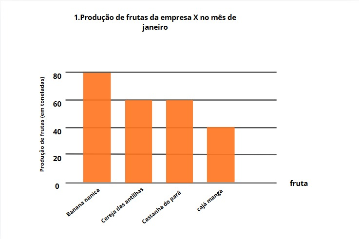
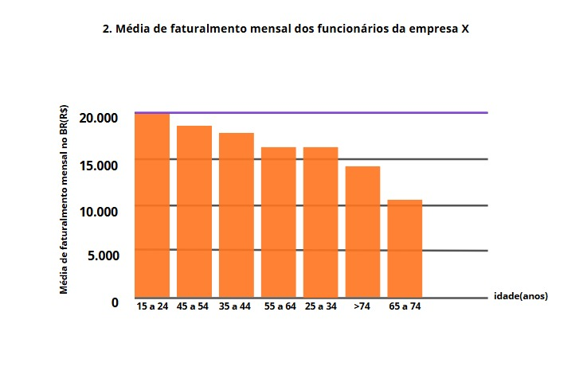
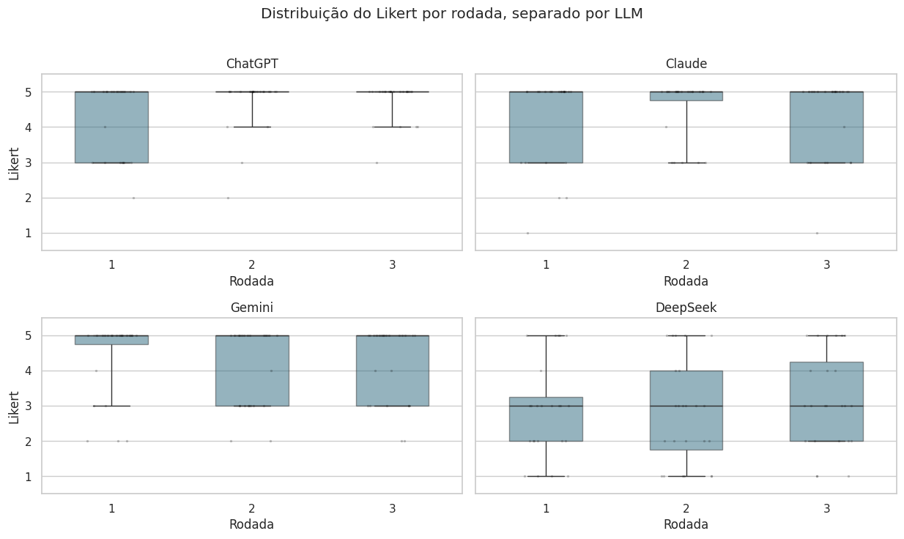
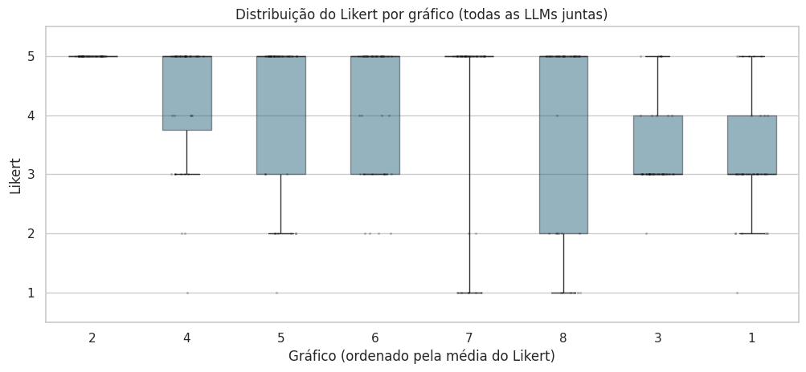
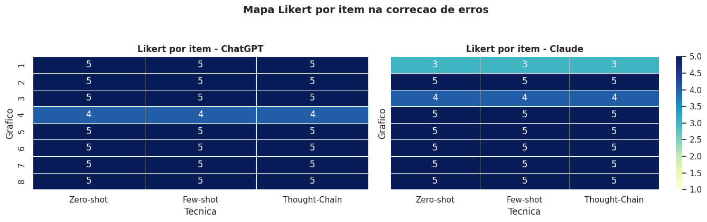
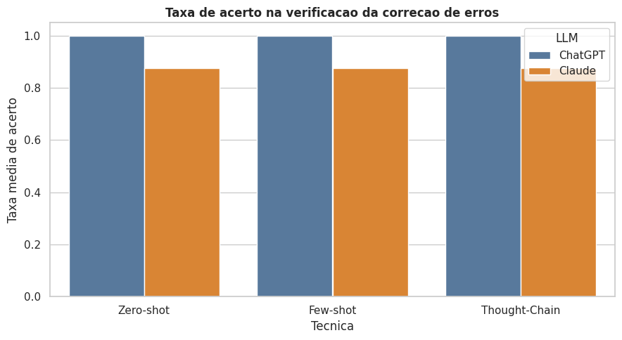

# Avaliação do uso de VLMs em Visualização de Dados
Desenvolvido por: Denilson Deivid Lima Silva  

Orientador: Prof. Dr. Maxwell Guimarães de Oliveira

Sou concluinte no Curso de Ciência da Computação na Universidade Federal de Campina Grande (UFCG), atualmente faço parte do Projeto de Tecnologias da Informação e Comunicação (TIC-Virtus) e atuo como monitor da cadeira de Visualização de Dados. 

Este repositório apresenta os materiais do TCC sobre o uso de modelos de linguagem de grande porte na análise de visualizações de dados. A pesquisa foi organizada para mostrar com clareza:

- quais gráficos foram estudados;
- como os modelos foram avaliados;
- onde estão os resultados de cada etapa;
- como acompanhar a evolução do trabalho.

Atualmente, a pesquisa está estruturada em duas frentes experimentais:

1. identificação de erros de visualização;
2. correção de erros de visualização.

## Síntese

O estudo investiga como diferentes VLMs respondem a tarefas relacionadas a visualização de dados em dois cenários complementares:

- detectar problemas visuais presentes em gráficos;
- propor ou verificar correções para esses problemas.

Os experimentos combinam imagens-base, respostas textuais de diferentes modelos, planilha de avaliação, notebooks analíticos e figuras comparativas produzidas ao longo da pesquisa.

## Contexto e insights

Para deixar o repositório mais autoexplicativo, foi adicionado um resumo textual do problema, da motivação e dos principais achados observados até aqui:

- [`docs/contexto-e-insights.md`](docs/contexto-e-insights.md): resumo da introdução e resumo da análise/discussão dos resultados

Em síntese:

- o trabalho parte da constatação de que erros de visualização comprometem a leitura de gráficos mesmo quando os dados estão corretos;
- a pesquisa investiga se VLMs conseguem identificar esses erros e propor correções com base em boas práticas da literatura;
- os resultados atuais sugerem melhor desempenho geral de GPT-5.4 e Claude;
- a eficácia da técnica de prompt varia conforme o modelo e a tarefa;
- a avaliação humana continua importante para validar justificativas, qualidade visual e presença de novos erros.

## Leitura rápida

Se você quer entender o repositório em poucos minutos, siga esta ordem:

1. leia este `README.md`;
2. TCC completo (docs/Avaliação_do_uso_de_modelos_multimodais_na_melhoria_de_visualização_de_dados_com_base_em_boas_práticas_da_literatura.pdf)
3. consulte [`docs/guia-de-leitura.md`](docs/guia-de-leitura.md);
4. veja a etapa de [`identificacao-de-erros`](experimentos/identificacao-de-erros/README.md);
5. veja a etapa de [`correcao-de-erros`](experimentos/correcao-de-erros/README.md);
6. consulte o material acadêmico em [`manuscrito/`](manuscrito/README.md).

## Onde está cada parte da pesquisa

| Bloco | Função |
|---|---|
| [`assets/imagens-base/`](assets/imagens-base/) | Gráficos-base estudados na pesquisa |
| [`dados/brutos/`](dados/brutos/) | Planilha central de avaliação |
| [`experimentos/identificacao-de-erros/`](experimentos/identificacao-de-erros/README.md) | Etapa de identificação de erros, com respostas, notebook e figuras |
| [`experimentos/correcao-de-erros/`](experimentos/correcao-de-erros/README.md) | Etapa de correção de erros, com respostas, notebook e figuras |
| [`docs/`](docs/) | Documentação de apoio, navegação e status da pesquisa |
| [`manuscrito/`](manuscrito/README.md) | TCC em PDF e materiais de apoio acadêmico |
| [`archive/`](archive/origem/README.md) | Registro da origem e reorganização do material |

## Estrutura do repositório

```text
.
|-- README.md
|-- docs/
|-- dados/
|   `-- brutos/
|-- assets/
|   `-- imagens-base/
|-- experimentos/
|   |-- identificacao-de-erros/
|   `-- correcao-de-erros/
|-- manuscrito/
`-- archive/
```

## Fluxo dos materiais

1. os gráficos-base ficam em `assets/imagens-base/`;
2. a planilha principal fica em `dados/brutos/`;
3. cada etapa experimental possui sua própria pasta em `experimentos/`;
4. dentro de cada etapa, as respostas brutas ficam em `dados/brutos/respostas-llms/`;
5. os notebooks ficam em `notebooks/`;
6. as figuras e saídas ficam em `resultados/`;
7. o material acadêmico fica em `manuscrito/`.

## Etapas experimentais

### Identificação de erros

Esta etapa analisa a capacidade dos modelos de identificar erros de visualização em gráficos. Ela concentra múltiplas rodadas, técnicas de prompting e respostas de diferentes LLMs.

- pasta principal: [`experimentos/identificacao-de-erros/`](experimentos/identificacao-de-erros/README.md)
- modelos presentes: ChatGPT, Claude, DeepSeek e Gemini
- materiais principais: respostas por rodada, notebook analítico e figuras de resultados

### Correção de erros

Esta etapa concentra a análise e verificação de respostas voltadas à correção de problemas de visualização, incluindo a proposta de versões corrigidas dos gráficos.

- pasta principal: [`experimentos/correcao-de-erros/`](experimentos/correcao-de-erros/README.md)
- modelos presentes: ChatGPT e Claude
- materiais principais: respostas brutas, notebook da etapa e figuras associadas

## Destaques visuais

### Gráficos-base

| Exemplo 1 | Exemplo 2 |
|---|---|
|  |  |

### Saídas da etapa de identificação

| Figura 1 | Figura 2 |
|---|---|
|  |  |

### Saídas da etapa de correção

| Figura 1 | Figura 2 |
|---|---|
|  |  |

Mais referências visuais estão em [`docs/resultados-em-destaque.md`](docs/resultados-em-destaque.md).

## Documentação complementar

- [`docs/guia-de-leitura.md`](docs/guia-de-leitura.md): percurso sugerido para ler o repositório
- [`docs/contexto-e-insights.md`](docs/contexto-e-insights.md): resumo da introdução e da discussão dos resultados
- [`docs/visao-geral.md`](docs/visao-geral.md): resumo dos blocos principais
- [`docs/metodologia.md`](docs/metodologia.md): descrição resumida da lógica metodológica
- [`docs/status-da-pesquisa.md`](docs/status-da-pesquisa.md): estado atual da pesquisa
- [`docs/organizacao-do-repositorio.md`](docs/organizacao-do-repositorio.md): mapa rápido das pastas
- [`docs/resultados-em-destaque.md`](docs/resultados-em-destaque.md): galeria comentada de figuras

## Status atual

- a organização do repositório já reflete o fluxo da pesquisa;
- a etapa de identificação de erros está mais ampla em modelos e rodadas;
- a etapa de correção de erros está organizada e pronta para expansão;
- novas tabelas, rodadas e consolidações podem ser adicionadas sem alterar a lógica principal.

## Observações

- os nomes das pastas e arquivos foram normalizados para facilitar navegação, versionamento e reprodução;
- o material original local foi reorganizado sem incluir o arquivo compactado bruto no versionamento;
- como a pesquisa está em andamento, o repositório foi preparado para crescimento incremental.
