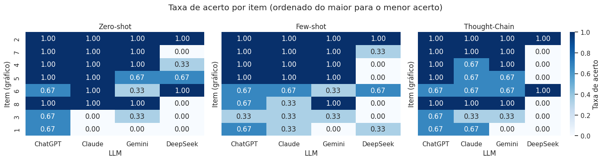
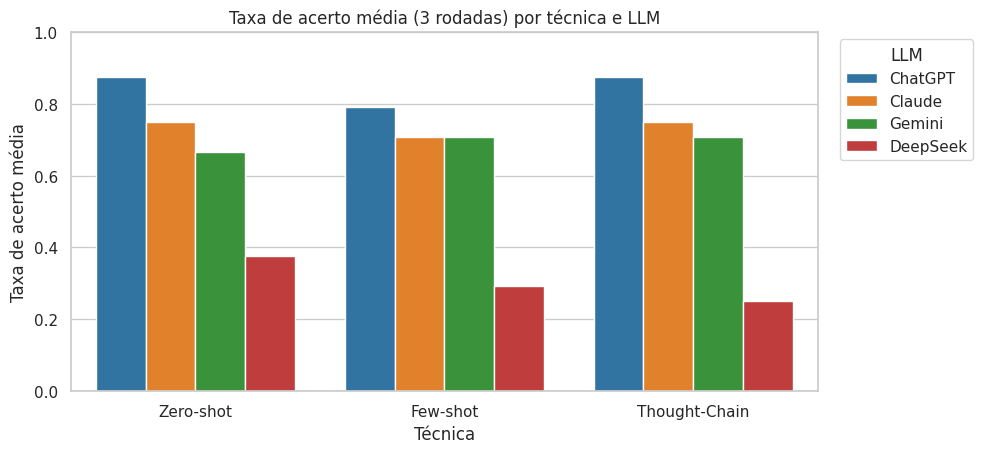
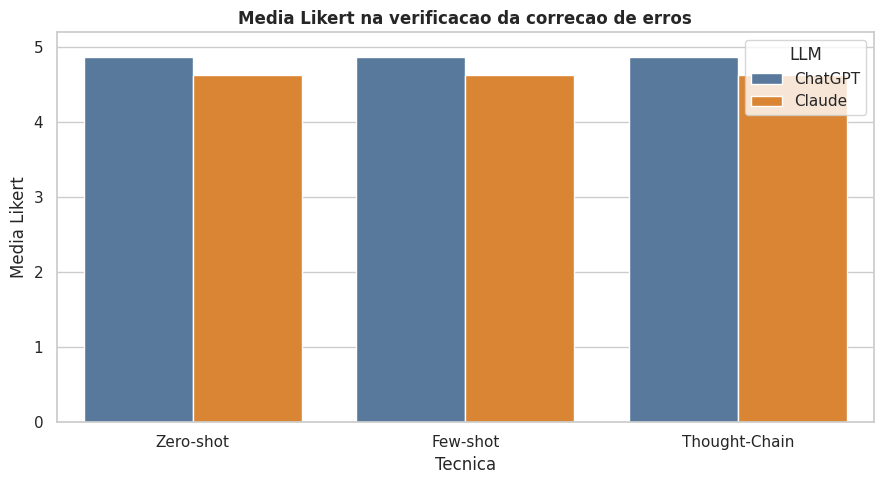
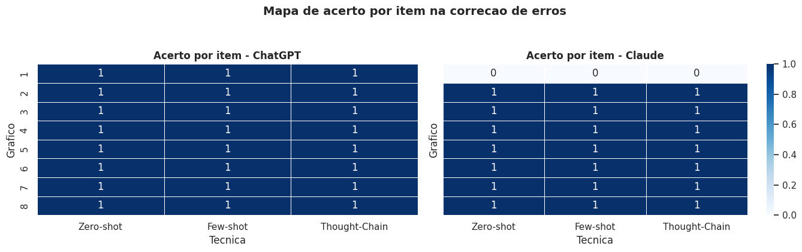

# Resultados em destaque

Esta pagina funciona como uma galeria resumida das imagens e saidas mais visiveis do repositorio.

## Base visual da pesquisa

Os graficos-base analisados ao longo da pesquisa estao em [`../assets/imagens-base/`](../assets/imagens-base/).

| Grafico 1 | Grafico 2 |
|---|---|
|  |  |

## Etapa de identificacao de erros

Esta etapa esta em [`../experimentos/identificacao-de-erros/`](../experimentos/identificacao-de-erros/README.md) e concentra a parte mais ampla do material experimental no momento.

| Figura 1 | Figura 2 |
|---|---|
|  |  |

| Figura 3 | Figura 4 |
|---|---|
|  |  |

## Etapa de correcao de erros

Esta etapa esta em [`../experimentos/correcao-de-erros/`](../experimentos/correcao-de-erros/README.md) e reune a parte de analise ligada a correcao dos problemas visuais.

| Figura 1 | Figura 2 |
|---|---|
|  |  |

| Figura 3 | Figura 4 |
|---|---|
|  |  |

## Como usar esta pagina

- use esta galeria como ponto de entrada visual;
- depois navegue para a pasta do experimento correspondente;
- por fim, consulte o notebook e os dados brutos da etapa para entender a origem de cada saida.
